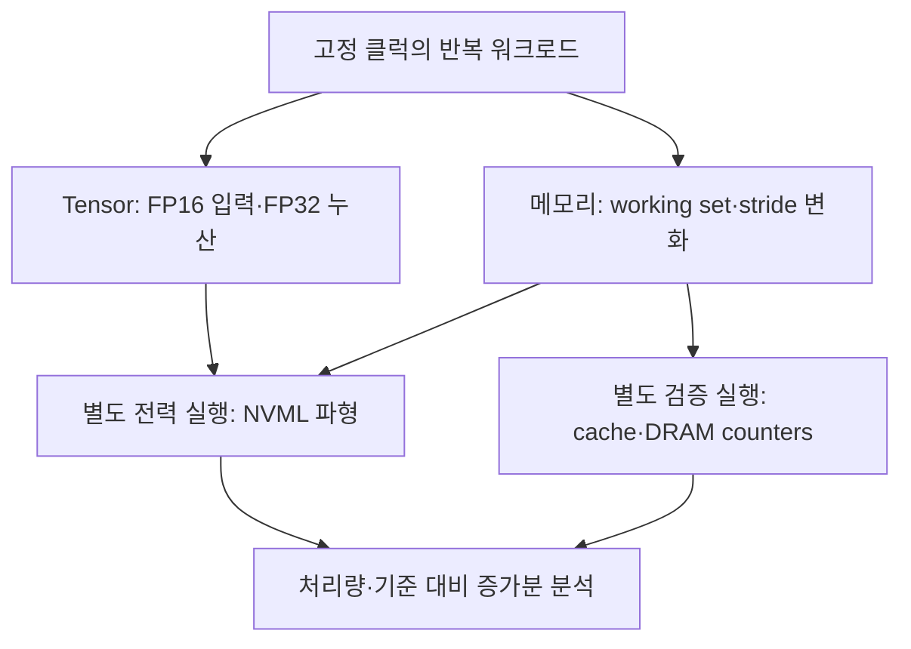

# V100·A100·H100 에너지 실험 설계

이 실험의 목적은 **지속 처리량이 충분히 높은 조건에서 연산·전송당 에너지가 가장 낮은 설정**을 찾는 것이다. 전력의 절대 최솟값만 찾으면 GPU를 쉬게 하는 설정이 선택된다. 따라서 관찰된 최대 처리량, 그 95% 이상을 유지하면서 전체/기준 대비 에너지가 가장 낮은 설정, 전력·처리량의 Pareto 경계를 함께 보고한다. Pareto 경계는 더 높은 처리량과 더 낮은 전력을 동시에 제공하는 다른 관측 설정이 없는 점들의 집합이다. 여기서 95%는 본 프로젝트가 정한 운영 기준이며 NVIDIA의 보장값이 아니다.

실측 전력이 없으면 idle 전력이나 각 블록의 에너지를 숫자로 확정하지 않는다. 이 저장소는 측정과 분석을 재현하는 도구이며, 예제나 CPU 테스트 결과는 GPU 측정 결과가 아니다.

## 1. 측정값의 의미

| 보고 항목 | 정의 | 해석 범위 |
|---|---|---|
| 전체 GPU 전력 | NVML이 보고한 GPU와 관련 회로의 전력 | CPU·서버 전체 입력 전력과 다르며 센서 범위를 기록해야 함 |
| 기준 전력 `P_ref` | 같은 요청 클럭 조건에서 CUDA 컨텍스트가 살아 있고 커널이 실행되지 않는 idle 구간 | 순수 누설 전력이나 물리적 static 전력이 아님 |
| 기준 대비 증가분 `P_inc` | `P_work − P_ref` | 연산기뿐 아니라 스케줄러·레지스터·클럭·데이터 경로의 변화도 포함 |
| active-control 차이 | `P_work − P_control` | 별도로 비교할 때의 정의; 자동 paired subtraction은 제공하지 않으며 제어 커널 자체도 전력을 소비 |
| 메모리 scope 전력 | 지원 장치에서 별도로 보고되는 GPU 메모리 전력 | API 지원·센서 범위를 확인해야 하며 HBM 셀만의 전력으로 단정하지 않음 |
| pJ/FLOP | `P / FLOP/s × 10^12` | 곱셈과 덧셈을 각각 1 FLOP으로 계산; MMA의 FMA는 2 FLOP |
| pJ/logical-byte | `P / 요청 byte/s × 10^12` | 코드가 요청한 바이트당 에너지; DRAM에서 실제 움직인 바이트와 다름 |
| pJ/physical-byte | `P / counter byte/s × 10^12` | 별도 프로파일에서 검증한 해당 계층의 전송 바이트 필요 |

`NVML`은 NVIDIA Management Library이다. 보드 센서 하나에서 Tensor Core·L1·L2·HBM의 물리적 static/dynamic 전력을 모두 독립적으로 관측할 수는 없다. 기준을 빼는 방식은 **실험 기준에 따른 증가분**을 구한다. 별도 rail 측정이나 잘 식별되는 회귀 모델 없이 이를 순수 dynamic으로 이름 붙이지 않는다.

평균 전력 `P`와 처리량 `R`이 같은 지속 실행 구간을 대표할 때 에너지 단가는 `e = P/R`이다. 클럭이 바뀌거나 온도가 계속 올라가는 구간의 전력과 다른 구간의 처리량을 섞으면 이 식의 의미가 달라진다. 파형을 적분한 에너지와 GPU의 누적 에너지 카운터 차이는 서로 교차 확인하지만 독립적인 계측기의 검증을 대신하지는 않는다.

## 2. 아키텍처별 확인 사항

| 항목 | V100 | A100 | H100 |
|---|---|---|---|
| 아키텍처 / compute capability | Volta / 7.0 | Ampere GA100 / 8.0 | Hopper / 9.0 |
| warp 크기 | 32 threads | 32 threads | 32 threads |
| 통합 L1·texture·shared 최대 용량/SM | 128 KiB | 192 KiB | 256 KiB |
| 일반 GPU의 L2 명목 용량 | 6 MiB급, 장치에서 조회 | 40 MB급, 장치에서 조회 | 50 MB급, 장치에서 조회 |
| L2 locality | SM·주소 경로를 실측 | 공식 백서의 2개 partition, 각 40×512 KiB slice | 공식 자료의 partitioned crossbar, 실제 경로 실측 |
| `nvmlDeviceGetPowerUsage` 의미 | 현재 전력 | 현재 전력: **GA100은 예외** | 약 1초 평균 전력 |
| 별도 memory power | 지원 여부 탐지 | 지원 여부 탐지 | 지원 여부 탐지; 아키텍처 이름만으로 지원 확정 금지 |
| Tensor 실험 경로 | FP16 입력, FP32 누산 WMMA / cuBLAS | 같은 공통 경로와 cuBLAS | 같은 공통 경로와 cuBLAS; 최신 Hopper 경로와 별도 구분 |

128/192/256 KiB는 **L1 전용 용량**이 아니라 shared memory와 공유하는 전체 최대 용량이다. 커널의 carveout, shared memory 할당, 동시에 상주하는 block 수에 따라 L1에 쓸 수 있는 용량이 달라진다. CUDA가 보고한 L2 바이트 수를 실험의 기준으로 쓰고, 문서의 MB 표기를 그대로 바이트 수로 변환하지 않는다. [S3–S7]

A100의 두 partition은 공식 백서에서 확인된다. H100의 50 MB와 partitioned crossbar도 확인되지만, 본 구현은 이를 근거로 모든 SKU를 고정된 **25 MB + 25 MB 주소 영역**으로 취급하지 않는다. `SM ID → GPC → L2 partition`이나 `가상 주소 → slice`의 공개된 범용 제어 API는 없다. SM 번호나 주소 offset의 절반만으로 near/far를 확정할 수 없다. [S3, S7]

## 3. 워크로드와 계층별 attribution

| 워크로드 | 실험 설계 | 반드시 확인할 것 | 에너지에 함께 들어가는 것 |
|---|---|---|---|
| Tensor WMMA | 작은 타일을 한 번 준비하고 반복 MMA; 여러 독립 accumulator, warp/block 및 block 수 sweep | FP16 입력·FP32 누산, 연산이 제거되지 않음, tensor 명령이 실제 생성됨 | Tensor operand 전달, register file, instruction issue, 제어 및 최소 입출력 |
| Tensor cuBLAS GEMM | 행렬 크기를 늘려 지속 dense FP16 GEMM을 실행 | `2MNK`, datatype, 누산, 라이브러리·툴킷, 실제 Tensor 경로와 수치 검증 | Tensor와 데이터 이동·캐시·HBM 전체 |
| L1 | `ld.global.ca`로 block별 작은 working set을 반복 읽음 | resident block들의 총 working set, L1 hit 및 낮은 L2/DRAM 트래픽 | load/store unit, 주소 계산, register·L1·제어 |
| L2 | `ld.global.cg`로 L1을 우회하고 L2보다 작은 working set을 반복 읽음 | L2 hit, DRAM bytes, L2 fabric 트래픽, partition 충돌 | L2+interconnect+SM의 load 발행/수신 |
| HBM | `ld.global.cg`, L2보다 충분히 큰 working set, coalesced streaming | DRAM 실측 대역폭, L2 hit, 메모리·SM 클럭에 따른 plateau | HBM+controller+L2+interconnect+SM |
| control | 같은 grid/thread 규모의 가벼운 정수 제어 커널 | 이 커널도 실제 ALU·제어 동작을 함 | active-control 기준 자체의 전력 |
| locality | `.cg` pointer chase, 주소 offset와 실제 실행 SM ID 변화 | 의존 load의 latency 분포와 가능하면 L2 fabric counter | 지연시간 지도; 고처리량 L2 에너지 실험과 분리 |

`WMMA`는 Warp Matrix Multiply Accumulate, `GEMM`은 General Matrix Multiply이다. 공통 WMMA는 세 세대 비교의 출발점이다. H100의 architecture-specific WGMMA, Tensor Memory Accelerator 등까지 포괄하는 최고 성능 구현은 공통 WMMA와 같은 실험으로 취급하지 않는다. cuBLAS 경로를 함께 측정하여 공통 microbenchmark의 포화 정도를 평가한다.

PTX의 `.ca`는 cache-all, `.cg`는 global-level caching의 힌트이다. `.cg`는 **L2를 우회하여 HBM만 읽는 명령이 아니다**. working set 크기만으로 계층이 확정되지 않으므로 counter 검증 전에는 결과를 해당 계층을 목표로 한 실험으로 해석한다. [S8]

## 4. thread·warp·SM·주소 설정

`SM`은 Streaming Multiprocessor, `GPC`는 Graphics Processing Cluster, block은 같은 SM에서 실행되는 thread 묶음이다. warp는 GPU가 묶어서 실행하는 32개 thread다. block 수를 SM 수와 같게 설정해도 각 SM에 정확히 하나씩 배치된다는 보장은 없다. 이 도구의 grid sweep은 **SM enable/disable 기능이 아니라 동시 작업량 변화**이다. 실제 SM 분포를 확인하려면 `%smid` 표본과 profiler 결과를 사용한다.

| 변수 | 권장 시작점 | 해석 |
|---|---|---|
| threads/block | 128, 256, 512 | warp 개수 및 register·shared 사용과 함께 해석 |
| blocks/SM 계수 | 1, 2, 4, 8 | grid=`SM 개수×계수`; 실제 residency와 다름 |
| L1 working set/block | 8–64 KiB 구간 | 동시에 상주하는 block들의 총량이 중요 |
| L2 working set | 조회된 용량의 0.1–0.7배부터 | slice 분포·replication·다른 트래픽에 따른 유효 용량 변화 |
| HBM working set | 조회 L2의 4배 이상부터 | GPU 메모리 여유를 확인하고 더 크게도 반복 |
| stride | 원소 단위 1, 2, 4, 8, 32 등 | 원소 크기를 곱해야 byte stride가 됨 |
| address offset | 정렬된 여러 offset | 주소에 따른 slice/partition 행동을 경험적으로 관찰 |
| 데이터 | 재현되는 nonzero pseudo-random | zero-filled 데이터의 압축·낮은 토글 활동과 구분 |

`KiB = 1,024 bytes`, `MiB = 1,048,576 bytes`이고, `GB/s = 10^9 bytes/s`이다. sector는 32 bytes, 일반 L1/L2 cache line은 128 bytes로 4 sectors이다. 32개 thread가 각각 정렬된 4-byte 원소를 연속 읽으면 요청량은 128 bytes이며 이상적인 sector 수는 4다. stride가 커지면 같은 logical bytes를 읽어도 많은 sectors가 움직일 수 있다. HBM stride sweep은 stride에 맞춰 할당 크기를 늘리고 전체 순환에서 방문할 수 있는 sector footprint가 최소 L2의 4배인지 검사한다. 가능한 주소 집합의 크기와 실제 실행에서 발생한 DRAM traffic은 다르므로 profiler 검증은 여전히 필요하다. cache throughput과 HBM bandwidth를 logical bytes만으로 비교하지 않는다. [S9]

## 5. 센서와 측정 시간

NVML 호출 이름이 같아도 평균 창이 다르다. 현재 공식 설명은 GA100 및 이전 세대의 `nvmlDeviceGetPowerUsage`가 현재 전력, GA100을 제외한 Ampere 이후 세대는 약 1초 평균이라고 명시한다. `NVML_FI_DEV_POWER_AVERAGE`와 `NVML_FI_DEV_POWER_INSTANT`를 각각 probe하고 사용 가능한 센서와 오류를 기록한다. `nvmlDeviceGetTotalEnergyConsumption`도 Volta 이후의 지원 장치에서 mJ 단위로 제공되지만 모든 환경에서 성공한다고 가정하지 않는다. [S1, S2]

기본 실험은 warmup 3초, 측정 12초, 전후 idle 각 6초, 50 ms polling, active 양 끝 2초 제외, 3회 반복이다. 50 ms마다 API를 부른다고 센서의 실제 갱신주기가 50 ms가 되지는 않는다. 평균 창을 비우기 위해 시작 이후 수초를 제외하고, 끝부분을 제외하여 shutdown·전이의 영향을 줄인다. 온도가 안정되지 않으면 warmup/측정 시간을 늘린다. 지속 작업으로 센서 갱신주기와 커널 실행의 우연한 위상 일치를 줄이고, 서로 다른 반복 길이에서도 추정값이 유지되는지 확인한다.

측정 시계는 monotonic host clock을 쓰고, GPU 처리 시간도 CUDA event로 별도 측정한다. 전력의 시간범위와 맞추는 sustained throughput에는 host duration을 사용하며 CUDA event 기준 throughput도 진단값으로 기록한다. Python이 worker를 시작한 시점만으로 workload 시작을 추정하지 않는다. worker의 단계 메시지와 sensor timestamps를 맞춰 setup, warmup, active, cooldown을 분리한다. 누적 카운터의 endpoint 에너지가 trimmed 구간보다 넓은 구간을 덮을 경우 같은 값을 섞어서 비교하지 않는다.

memory scope가 실제 지원되면 메모리와 전체 GPU 채널을 각각 보고한다. 동일 시각·평균창·포함 관계가 확인되지 않은 GPU와 memory 값을 단순히 더하거나 빼서 core rail을 확정하지 않는다. 최신 NVML에는 `NVML_POWER_SCOPE_MEMORY`가 있고, `nvidia-smi`는 GPU Memory Power Readings를 문서화한다. 공개 API의 존재는 개별 H100에서 지원된다는 보장이 아니다. [S2, S10]

## 6. 클럭과 DVFS

`DVFS`는 Dynamic Voltage and Frequency Scaling, 즉 부하에 따라 전압과 주파수를 조절하는 기능이다. 이 도구는 지원되는 SM·메모리 클럭을 요청하고 실제 클럭을 함께 기록한다. 전압을 직접 고정하거나 읽을 수 없는 환경에서는 같은 MHz가 같은 전압·전력을 뜻하지 않는다. power cap, 온도, idle clock gating에 따라 요청한 클럭과 실제 클럭이 달라질 수 있다.

| 비교 목적 | 구성 | 주의점 |
|---|---|---|
| 같은 core 주파수 | 세 장치가 지원하는 공통 SM MHz | 공정·전압·SM 수가 달라 총 전력은 같지 않음 |
| 같은 memory 설정 | 각 SKU 지원 범위와 상대 단계 비교 | HBM 세대별 raw MHz를 같은 bandwidth로 해석하지 않음 |
| SKU별 최고 처리량 | 각 장치의 허용 peak 설정 | 공통 클럭 결과와 다른 표로 비교 |
| 효율 최적화 | SM×memory clock 격자와 power cap 층 | 서로 다른 cap/온도 결과를 한 기준으로 혼합하지 않음 |

HBM에서는 memory clock을 고정한 뒤 SM clock을 올려 bandwidth가 포화되는 지점을 찾고, SM clock을 고정한 뒤 memory clock을 바꾼다. 낮은 SM clock에서 HBM bandwidth가 떨어지는 이유는 memory clock만이 아니라 load 발행량·주소 계산·interconnect·L2의 공급 능력일 수 있다. tensor·L1·L2도 클럭별 plateau를 따로 찾는다.

각 층에서 반복 중앙값을 사용한다. 조건 `R >= 0.95 × R_max`를 만족하는 설정 중 증가분 pJ/unit가 가장 작은 설정과 전체 pJ/unit가 가장 작은 설정을 각각 선택한다. 두 기준의 선택 차이와 Pareto 경계를 함께 검토한다. `R_max`는 **실험에서 관찰한 최대값**이며 이론적 peak가 아니다. 반복 수·변동폭을 함께 확인하고, 좁은 차이를 물리적 최솟값이라고 단정하지 않는다.

클럭 변경에는 드라이버·권한 제한이 있을 수 있다. 실패를 조용히 기본 DVFS 실행으로 바꾸지 않고 명시한다. 커널이 없는 idle 구간에는 높은 요청 클럭에서도 hardware gating으로 실제 클럭이 내려갈 수 있다. 이런 기준은 requested-clock-matched reference이며, 모든 실험에서 실제 active idle 상태가 일치한다고 부르지 않는다. `baseline_clock_matched`와 `baseline_temperature_matched`로 idle와 active 상태의 일치를 별도 기록한다. `dynamic_attribution_eligible`는 품질·profiler·기준 상태의 전제조건이 충족되었는지를 나타내며 순수 physical dynamic의 분리 증명이 아니다. [S10]

## 7. near/far L2 실험

1. 작은 `.cg` 의존 pointer chase로 L2에 데이터를 올리고 주소 offset·실행 SM별 latency를 반복 측정한다.
2. L2 hit 및 DRAM 유입이 충분히 작은지 확인한다. pointer chase 자체는 latency 측정이므로 대역폭 포화를 주장하지 않는다.
3. 가능하면 Nsight Compute의 L2 Fabric Total 또는 지원되는 관련 counter로 partition 간 트래픽을 확인한다.
4. offset·SM 조합별 latency와 fabric 트래픽의 일관된 군집이 관측될 때 near/far **후보**를 정한다. 단일 관측, SM 번호 절반, 가상 주소 절반으로 분류하지 않는다.
5. 에너지 비교에는 그 후보의 주소 배치로 고처리량 workload를 별도로 실행한다. scheduling과 실제 SM 분포가 바뀌면 지도도 다시 검증한다.

현재 도구의 locality 결과는 경험적 latency 지도다. 공개 CUDA API로 특정 GPC와 물리 L2 partition을 확정하여 고정하는 기능은 제공하지 않는다. 이 한계를 제거하려면 장치별 reverse engineering·추가 counters·실행 배치 검증이 필요하다.

## 8. 별도 counter 검증

전력 실행과 Nsight Compute 실행을 분리한다. profiler는 replay, cache flushing, clock locking을 수행할 수 있으므로 그 실행에서 읽은 NVML 전력을 일반 실행 전력으로 섞으면 안 된다. 외부에서 클럭을 요청한 동일 조건으로 짧고 결정적인 workload를 profile하고 `--clock-control none`, `--cache-control none`을 사용한다. cache priming이 필요한 경우 application replay가 적합하다. 장치·버전에 따라 counter 이름이 다르므로 먼저 `ncu --query-metrics`로 확인한다. 검증 실행은 warmup batch 1개와 측정 batch 1개를 결정적으로 실행하며 custom kernel은 warmup launch를 건너뛰고 측정 launch 하나를 profile한다. pointer chase의 warmup 1회가 전체 working set을 cache에 올리기에 부족할 수 있으므로 actual hit와 DRAM bytes를 검토한 evidence만 연결한다. [S9]

| 대상 | 검증 항목 |
|---|---|
| Tensor | tensor pipe 활동·명령, SM 처리량, occupancy, register spills |
| L1 | L1 sector hit, L2로 가는 miss, load requests·sectors |
| L2 | L2 hit, DRAM bytes, L2 Fabric Total/지원 fabric metrics |
| HBM | DRAM read/write bytes 및 대역폭, L2 hit와 압축 가능성 |
| 모든 실험 | 실제 SM·memory clocks, throttling 사유, 일정한 온도, numerical/checksum 검증 |

warm cache 검증에서 default cache flushing을 쓰면 검증하려는 상태가 사라질 수 있다. 하지만 flushing을 껐다고 cache hit가 보장되는 것도 아니다. 결과를 먼저 보고 계층 attribution을 결정한다.

## 9. 공정한 비교를 위한 실험 환경

- 동일한 CUDA toolkit·cuBLAS 버전을 가능하면 사용하고, 버전·컴파일 옵션·커널 SHA를 결과와 함께 보관한다. V100용 `sm_70`을 포함한 공통 비교에는 CUDA 12.x를 사용한다. CUDA 13.0에서 Volta의 offline compilation과 library support가 제거되었다. [S14]
- GPU UUID와 PCI bus ID를 기준으로 NVML과 CUDA worker가 같은 물리 장치를 선택하는지 확인한다. `CUDA_VISIBLE_DEVICES`는 worker의 ordinal을 재배치할 수 있다.
- MIG(Multi-Instance GPU), MPS(Multi-Process Service), ECC(Error Correcting Code), 다른 GPU 프로세스, persistence 및 power cap 상태를 기록한다. 전체 GPU 모델 비교는 같은 자원 범위를 사용한다.
- 냉각·팬·공기 온도, GPU 및 memory 온도, throttling 사유를 확인한다. 시작/끝 기준 전력의 차이가 크면 기준 subtraction과 최소값 해석을 보류한다.
- 행렬값·메모리값 seed를 기록하고 nonzero 비압축 데이터와 별도 zero 데이터 실험을 구분한다. zero fill만 사용하면 bandwidth와 스위칭 활동을 편향시킬 수 있다.
- 반복 순서를 섞고 충분한 thermal conditioning을 수행한다. 첫 cold run만 낮은 전력인 설정을 최적값으로 선택하지 않는다.

## 10. 모델링 및 idle 비율

첫 모델은 클럭·온도·SKU가 같은 층에서 다음 형태를 고려한다.

`P = P_ref + P_active + e_tensor R_tensor + e_L1 B_L1 + e_L2 B_L2 + e_HBM B_HBM + residual`

이 식은 설계 형태이며 네 개의 microbenchmark 결과를 더하면 자동으로 물리적 전력이 복원된다는 뜻이 아니다. 각 workload는 공유 경로를 사용하고 상관된 counter를 만든다. 먼저 단일 workload의 **기준 대비 증가분 기울기**를 확인한다. 여러 블록을 함께 쓰는 모델은 각각의 활동을 독립적으로 변화시킨 calibration, counter 기반 특징, 설계 행렬의 rank/condition 점검, 알려지지 않은 mixed workload holdout 검증이 필요하다. 식별되지 않는 계수는 결과를 내지 않는다. idle baseline, active control, tensor와 memory 데이터가 서로 중복 집계되지 않게 정의한다. 현재 control은 별도 workload로 기록된다. 분석의 `active_control_associations`는 같은 장치·요청 클럭·block/thread·SM filter인 control을 설명용으로 연결하며, 명령어 구성이 다르므로 자동 차감하여 component 에너지로 해석하지 않는다.

`fit`은 사용자가 명시적으로 준비한 활동률 feature rows에 대해 증가분 전력을 회귀한다. 미측정 feature를 0으로 자동 채우지 않는다. 별도 장치와 클럭 층을 섞는 모델, rank가 부족하거나 condition이 나쁜 설계는 거부한다. logical throughput만으로 fitting한 계수는 workload의 계수이며 순수 L1/L2/HBM 회로 계수가 아니다. 독립적인 mixed-workload validation이 통과하기 전에는 동시에 여러 활동을 쓰는 일반 애플리케이션의 예측을 허용하지 않는다. calibration 범위 밖 외삽은 별도로 다룬다. 현재 harness는 concurrent mixed workload의 실제 feature rows를 자동 수집하지 않으므로 사용자가 별도 측정·counter 검증으로 준비해야 한다.

| 질문 | 계산 | 의미 |
|---|---|---|
| 실제 부하 전력 중 idle 기준 몫 | `100 × P_ref / P_work` | 측정한 기준이 실제 부하 전력에서 차지하는 비율 |
| power limit 대비 idle 기준 몫 | `100 × P_ref / P_limit` | 설정된 상한 대비 기준의 크기 |
| 남은 상한 | `P_limit − P_work` | 전력 상한까지의 차이; idle과 다름 |
| 같은 클럭의 달성 처리량 | `measured FLOP/s / clock-specific dense ceiling` | actual SM 개수·actual MHz·dense/sparse·누산 조건을 일치시켜야 함 |

코드는 장치의 실제 SM 개수와 active 구간의 실측 SM MHz를 사용한다. dense FP16 입력·FP32 누산의 이론 issue capacity는 V100 1,024, A100 2,048, H100 4,096 FLOP/SM/cycle이다. `peak TFLOP/s = SM 수 × MHz × FLOP/SM/cycle × 10^-6`로 해당 클럭의 ceiling을 계산한다. 이는 data delivery 및 scheduling 손실이 없는 경우의 상한이며 공통 WMMA 커널의 보장 성능이 아니다. [S3, S7, S13]

400 W는 특정 A100 SXM의 최대 TDP(Thermal Design Power)이고, 312 TFLOPS는 dense FP16 Tensor peak이다. **312 TFLOPS를 낸 순간의 전력이 항상 400 W라는 뜻은 아니다.** 따라서 데이터시트의 두 수치만으로 idle 전력이나 idle 비율을 역산할 수 없다. A100 SXM 80 GB의 공식 예시는 400 W, dense 312 / sparse 624 TFLOPS, 2,039 GB/s이며, 40 GB의 HBM 대역폭은 1,555 GB/s이다. V100과 H100, PCIe와 SXM, H100 NVL은 별도 SKU다. [S11]

H100 현재 제품 표의 SXM FP16 값 1,979 TFLOPS에는 sparsity가 포함된다. dense 비교에는 약 절반인 989 TFLOPS급 기준을 사용하고 reference가 반올림된 값임을 기록한다. 최대 TDP는 구성 가능한 700 W급이며 A100의 400 W/312 TFLOPS와 같은 기준을 그대로 적용하지 않는다. [S12]

## 11. 실행 후 결론을 내리는 순서

1. raw sensor·worker 로그에서 구간·UUID·클럭·오류를 확인한다.
2. 시작/끝 idle 기준, active-control 전력, 온도 및 throttling의 일관성을 확인한다.
3. profiler로 의도한 계층이 실제로 주된 데이터 공급원인지 검증한다.
4. repeat 중앙값과 변동폭을 보고 max-throughput/95%-plateau/효율 설정을 선택한다.
5. 전체 전력과 기준 대비 증가분의 pJ/FLOP 또는 pJ/byte를 둘 다 비교한다.
6. SKU reference peak와 **측정된** peak를 구분하여 idle 비율과 모델 계수를 해석한다.

공식 자료와 출처 번호는 [sources.md](sources.md)에 정리되어 있다.
