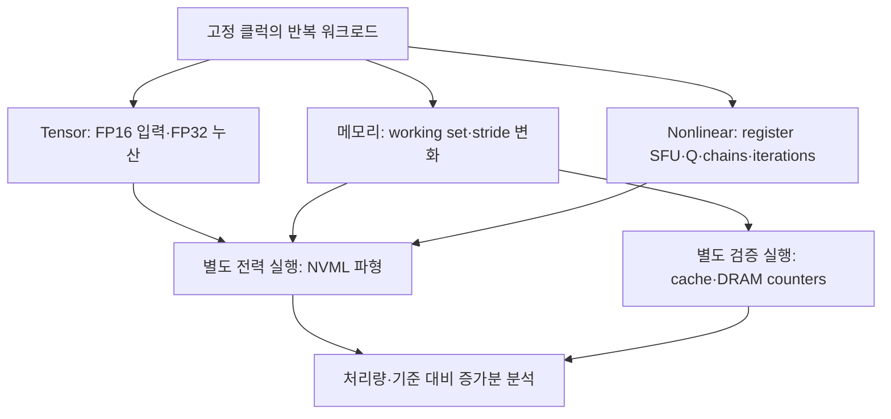

# V100·A100·H100 에너지 실험 설계

이 실험의 목적은 **각 GPU를 충분히 활용하는 조건에서 실측 pJ/FLOP·pJ/bit가 가장 낮은 설정과 주변 측정점**을 찾는 것이다. 전력의 절대 최솟값만 찾으면 GPU를 쉬게 하는 설정이 선택된다. 각 frequency pair에서 NCU·품질·정확한 시간 정렬을 통과한 최소 2개의 resource geometry를 실제로 비교한다. HBM을 제외한 계층·연산은 비교한 유효 geometry의 관측 최고 처리량의 95% 이상을 유지하는 설정으로 효율 최적점을 찾고, 전체 clock sweep 최고 처리량의 95% 이상을 요구하는 성능 제약 선택도 별도로 보고한다. HBM 후보는 그 95% 대신, 같은 에너지 구간의 logical byte/s가 해당 memory clock 이론 bandwidth의 80% 이상인지를 본다. 전체 에너지·승인된 idle 증가분·승인된 paired-reference 대비를 각각 비교한다. Pareto 경계는 더 높은 처리량과 더 낮은 전력을 동시에 제공하는 다른 관측 설정이 없는 점들의 집합이다. 95%는 본 프로젝트의 운영 기준이며 NVIDIA의 보장값이 아니다.

실측 전력이 없으면 idle 전력이나 각 블록의 에너지를 숫자로 확정하지 않는다. 이 저장소는 측정과 분석을 재현하는 도구이며, 예제나 CPU 테스트 결과는 GPU 측정 결과가 아니다.

기본 nonlinear 실험은 [register-resident native SFU microbenchmark](nonlinear-experiments.ko.md)다.
`configs/nonlinear*.json`은 EX2·LG2·RCP·RSQRT·SQRT·TANH 근사 명령을 대상으로 한다.
V100은 native TANH가 없어 5개를 실행한다. 주 결과는 SFU 명령을 제거한 register-loop
control 대비 signed pJ/scalar SFU instruction이며, 전체 GPU·idle 단가는 진단용이다.
Global 입출력·reduction을 포함한 [과거 전체 함수 실험](legacy/nonlinear-streaming.ko.md)은
명시적 `nonlinear_mode: "streaming"` 설정으로만 새로 실행하며 별도 분석 계약을 유지한다.

[시각화 HTML 문서](experiment-design.html)는 treatment/reference 도식, clock coverage, 실제 plan·summary JSON의 로컬 뷰어를 제공한다. 외부 자원이나 서버 업로드 없이 실행된다. 문서 도식은 측정 데이터가 아니다.

**대상 GPU는 모두 SXM 모듈이다.** SXM은 GPU 모듈 장착 형태이고 HBM(High Bandwidth Memory)은 측정하려는 메모리 계층이다. SXM과 HBM은 서로 대체되는 GPU 버전 이름이 아니다. 대표 비교 표기는 V100 SXM2·A100 SXM4·H100 SXM5이며, 실제 SKU·메모리 용량·SM 수·power limit은 discovery로 확인한다. SXM 이름이 확인되지 않는 장치는 계획 단계에서 자동 확정하지 않으며 명시적 SXM 확인 근거가 필요하다.

## 1. 측정값의 의미

| 보고 항목 | 정의 | 해석 범위 |
|---|---|---|
| 전체 GPU 전력 | NVML이 보고한 GPU와 관련 회로의 전력 | CPU·서버 전체 입력 전력과 다르며 센서 범위를 기록해야 함 |
| 기준 전력 `P_ref` | 같은 요청 클럭 조건에서 CUDA 컨텍스트가 살아 있고 커널이 실행되지 않는 idle 구간 | 순수 누설 전력이나 물리적 static 전력이 아님 |
| 기준 대비 증가분 `P_inc` | `P_work − P_ref` | 연산기뿐 아니라 스케줄러·레지스터·클럭·데이터 경로의 변화도 포함 |
| paired active-reference 대비 | `P_treatment − P_active_reference` | 같은 process·context·할당·clock policy에서 AB/BA로 짝지어 측정; 제어 커널도 전력을 쓰며 순수 회로 isolation이 아님 |
| 메모리 scope 전력 | 지원 장치에서 별도로 보고되는 GPU 메모리 전력 | API 지원·센서 범위를 확인해야 하며 HBM 셀만의 전력으로 단정하지 않음 |
| pJ/FLOP | `P / FLOP/s × 10^12` | 곱셈과 덧셈을 각각 1 FLOP으로 계산; MMA의 FMA는 2 FLOP |
| SFU pJ/scalar instruction | `(P_treatment − P_register_control) / treatment instruction/s × 10^12` | Native primitive를 원소 하나에 적용한 호출 1회; 분모는 완료 launches×Q×chains×iterations이며 순수 SFU rail 에너지는 아님 |
| pJ/logical-bit | `E / (완료 요청 byte×8) × 10^12` | 코드가 요청한 유효 payload bit당 에너지; `pJ/bit=pJ/byte÷8`, DRAM에서 실제 움직인 바이트와 다름 |
| pJ/physical-bit | `E / 실제 계층 전송 bit × 10^12` | 해당 계층 counter와 지속 에너지 구간의 work·시간 기준 provenance 필요; 현재 NCU replay byte만으로 산출하지 않음 |

`NVML`은 NVIDIA Management Library이다. 보드 센서 하나에서 Tensor Core·L1·L2·HBM의 물리적 static/dynamic 전력을 모두 독립적으로 관측할 수는 없다. 기준을 빼는 방식은 **실험 기준에 따른 증가분**을 구한다. 별도 rail 측정이나 잘 식별되는 회귀 모델 없이 이를 순수 dynamic으로 이름 붙이지 않는다.

### Treatment·idle·active reference의 세 가지 질문

Treatment는 측정할 Tensor·L1·L2·HBM 작업이다. 기본 custom workload는 같은 process에서 issue-loop `control`과 짝지어 실행한다. geometry와 loop 규모는 공유하지만 control도 integer ALU·주소 계산·제어·launch·store 등을 수행한다. 대상과 register·occupancy·cache·명령 경로가 같은 물리적 counterfactual이라고 부르지 않는다. cuBLAS GEMM에는 library 내부 geometry가 있으므로 기본 paired reference를 적용하지 않는다. 명시적으로 GEMM과 coarse control을 비교해도 matched-component objective로 승인하지 않는다.

1. **전체 단가**는 treatment 구간의 모든 GPU 관측 에너지를 완료한 work로 나눈다. baseline 문제와 분리해서 품질을 판단한다.
2. **운영상 idle 증가분**은 전후 context-idle를 treatment 시점으로 보간한 기준을 사용한다. actual clock·온도·power cap·조회 가능한 pstate/enforced cap·process inventory·drift가 일치하는지를 검사하며, 미일치 차감값은 진단에 남기고 승인된 최적점에서 제외한다.
3. **Paired active-reference 대비**는 같은 process·context·버퍼·clock policy의 두 arm에서 각각 정렬한 평균 전력의 차이를 treatment rate로 나눈다. 실제 클럭·온도·cap·조회 가능한 pstate/enforced cap·상태·geometry·시간 경계·interference가 승인되어야 한다. 순서에 따른 편향을 살피기 위해 AB/BA를 반복마다 교대한다. 음의 차이는 0으로 clamp하지 않고 부호를 보존하며 최적점 후보로 사용하지 않는다.

`baseline_valid`·`baseline_issues`·`baseline_state_matched`·`baseline_state_issues`·`operational_idle_increment_eligible`·`paired_active_reference_eligible`와 개별 이유를 보고한다. idle 또는 reference가 불충분해도 treatment 자체의 전체 에너지가 유효하면 보존한다. 하나의 기준 차감 결과로 전체 결과를 모두 탈락시키거나 순수 dynamic 에너지로 이름 붙이지 않는다.

평균 전력 `P`와 처리량 `R`이 같은 지속 실행 구간을 대표할 때 에너지 단가는 `e = P/R`이다. 클럭이 바뀌거나 온도가 계속 올라가는 구간의 전력과 다른 구간의 처리량을 섞으면 이 식의 의미가 달라진다. 파형을 적분한 에너지와 GPU의 누적 에너지 카운터 차이는 서로 교차 확인하지만 독립적인 계측기의 검증을 대신하지는 않는다.

## 2. 아키텍처별 확인 사항

| 항목 | V100 | A100 | H100 |
|---|---|---|---|
| 아키텍처 / compute capability | Volta / 7.0 | Ampere GA100 / 8.0 | Hopper / 9.0 |
| warp 크기 | 32 threads | 32 threads | 32 threads |
| 통합 L1·texture·shared 최대 용량/SM | 128 KiB | 192 KiB | 256 KiB |
| 일반 GPU의 L2 명목 용량 | 6 MiB급, 장치에서 조회 | 40 MB급, 장치에서 조회 | 50 MB급, 장치에서 조회 |
| L2 locality | SM·주소 경로를 실측 | 공식 백서의 2개 partition, 각 40×512 KiB slice | 공식 자료의 partitioned crossbar, 실제 경로 실측 |
| `nvmlDeviceGetPowerUsage` 의미 | 현재 전력 | 현재 전력: **GA100은 예외** | 약 1초 평균 전력 |
| 별도 memory power | 지원 여부 탐지 | 지원 여부 탐지 | 지원 여부 탐지; 아키텍처 이름만으로 지원 확정 금지 |
| Tensor 실험 경로 | FP16 입력, FP32 누산 WMMA / cuBLAS | 같은 공통 경로와 cuBLAS | 같은 공통 경로와 cuBLAS; 최신 Hopper 경로와 별도 구분 |

128/192/256 KiB는 **L1 전용 용량**이 아니라 shared memory와 공유하는 전체 최대 용량이다. 커널의 carveout, shared memory 할당, 동시에 상주하는 block 수에 따라 L1에 쓸 수 있는 용량이 달라진다. CUDA가 보고한 L2 바이트 수를 실험의 기준으로 쓰고, 문서의 MB 표기를 그대로 바이트 수로 변환하지 않는다. [S3–S7]

A100의 두 partition은 공식 백서에서 확인된다. H100의 50 MB와 partitioned crossbar도 확인되지만, 본 구현은 이를 근거로 모든 SKU를 고정된 **25 MB + 25 MB 주소 영역**으로 취급하지 않는다. `SM ID → GPC → L2 partition`이나 `가상 주소 → slice`의 공개된 범용 제어 API는 없다. SM 번호나 주소 offset의 절반만으로 near/far를 확정할 수 없다. [S3, S7]

## 3. 워크로드와 계층별 attribution

| 워크로드 | 실험 설계 | 반드시 확인할 것 | 에너지에 함께 들어가는 것 |
|---|---|---|---|
| Tensor WMMA | WMMA API `m16n16k16`, FP16 입력·FP32 누산. A·B는 launch당 한 번 register fragment로 읽은 뒤 반복 `mma_sync`. shared operand나 raw PTX `mma.m16n8k16`이 아님. accumulator·warp/block sweep | FP16·FP32 누산, 연산이 제거되지 않음, tensor 명령이 실제 생성됨. WMMA shape와 SASS의 `mma` shape가 같다고 단정하지 않음 | register file, instruction issue, 제어 및 최소 입출력. 반복 구간의 L1/shared 재읽기 에너지가 아님 |
| Tensor cuBLAS GEMM | 행렬 크기를 늘려 지속 dense FP16 GEMM을 실행 | `2MNK`, datatype, 누산, 라이브러리·툴킷, 실제 Tensor 경로·finite sample/checksum; 기준 결과와의 정확도 비교는 별도 | Tensor와 데이터 이동·캐시·HBM 전체 |
| Native SFU — 기본 nonlinear | Q개 register lane의 1/4/8 chain에서 native 근사 명령 반복; 같은 loop에서 SFU를 뺀 control | Binary-bound SASS에서 native 명령 유지·hot-loop 데이터 load/store·spill 부재, scalar/warp count, one-step 수치 검증, matched control과 CI | Signed control 차분에도 issue·register·scheduling 차이가 남음; 초기화·loop 후 lane당 4 B sink·launch를 iterations로 amortize |
| L1 | `ld.global.ca`로 block별 작은 working set을 반복 읽음 | resident block들의 총 working set, L1 hit 및 낮은 L2/DRAM 트래픽 | load/store unit, 주소 계산, register·L1·제어 |
| L2 | `ld.global.cg`로 L1을 우회하고 L2보다 작은 working set을 반복 읽음 | L2 hit, DRAM bytes, L2 fabric 트래픽, partition 충돌 | L2+interconnect+SM의 load 발행/수신 |
| HBM | `ld.global.cg`, L2보다 충분히 큰 working set, coalesced streaming | DRAM 실측 대역폭, L2 hit, 메모리·SM 클럭에 따른 plateau | HBM+controller+L2+interconnect+SM |
| control | 같은 grid/thread 규모의 가벼운 정수 제어 커널 | 이 커널도 실제 ALU·제어 동작을 함 | active-control 기준 자체의 전력 |
| locality | `.cg` pointer chase, 주소 offset와 실제 실행 SM ID 변화 | 의존 load의 latency 분포와 가능하면 L2 fabric counter | 지연시간 지도; 고처리량 L2 에너지 실험과 분리 |

`WMMA`는 Warp Matrix Multiply Accumulate, `GEMM`은 General Matrix Multiply이다. 공통 커널은 CUDA WMMA API의 `m16n16k16`이다. PTX ISA 9.4에서 floating-point `wmma`는 `sm_70` 이상이고 FP16 shape는 `.m16n16k16`, `.m8n32k16`, `.m32n8k16`이다. raw `mma`의 `.f16` `.m16n8k8`은 `sm_75` 이상, `.f16` `.m16n8k16`은 `sm_80` 이상이므로 V100 공통 경로가 아니다. [S8] 이 WMMA shape가 어떤 SASS `mma`로 내려가는지는 이 저장소의 측정 주장이 아니다. H100의 architecture-specific WGMMA, Tensor Memory Accelerator 등까지 포괄하는 최고 성능 구현은 공통 WMMA와 같은 실험으로 취급하지 않는다. cuBLAS 경로를 함께 측정하여 공통 microbenchmark의 포화 정도를 평가한다. dense FP16 ceiling(H100 4,096 FLOP/SM/cycle 포함)은 그 공통 커널의 도달 성능이 아니다.

PTX의 `.ca`는 cache-all, `.cg`는 global-level caching의 힌트이다. `.cg`는 **L2를 우회하여 HBM만 읽는 명령이 아니다**. working set 크기만으로 계층이 확정되지 않으므로 counter 검증 전에는 결과를 해당 계층을 목표로 한 실험으로 해석한다. [S8]

## 4. thread·warp·SM·주소 설정

`SM`은 Streaming Multiprocessor, `GPC`는 Graphics Processing Cluster, block은 같은 SM에서 실행되는 thread 묶음이다. warp는 GPU가 묶어서 실행하는 32개 thread다. block 수를 SM 수와 같게 설정해도 각 SM에 정확히 하나씩 배치된다는 보장은 없다. 이 도구의 grid sweep은 **SM enable/disable 기능이 아니라 동시 작업량 변화**이다. 실제 SM 분포를 확인하려면 `%smid` 표본과 profiler 결과를 사용한다.

| 변수 | 권장 시작점 | 해석 |
|---|---|---|
| threads/block | 128, 256, 512 | warp 개수 및 register·shared 사용과 함께 해석 |
| blocks/SM 계수 | 1, 2, 4, 8 | grid=`SM 개수×계수`; 실제 residency와 다름 |
| L1 working set/block | 8–64 KiB 구간 | 동시에 상주하는 block들의 총량이 중요 |
| L2 working set | 조회된 용량의 0.1–0.7배부터 | slice 분포·replication·다른 트래픽에 따른 유효 용량 변화 |
| HBM working set | 조회 L2의 4배 이상부터 | GPU 메모리 여유를 확인하고 더 크게도 반복 |
| stride | 이동 에너지 read는 `stride_words=1`; 2/4/8/32는 진단 | word=4 B. stride 4는 레인 간 16 B로 이상적 sector 효율 25% |
| address offset | 이동 에너지 read는 기본 0 B; 본 실험은 32 B 정렬 | 여러 offset의 locality/정렬 비교는 진단 역할로 분리 |
| 데이터 | 재현되는 nonzero pseudo-random | zero-filled 데이터의 압축·낮은 토글 활동과 구분 |

위 working-set·stride·offset 축은 메모리 실험에 적용한다. 기본 nonlinear/SFU의 Q는
메모리 footprint가 아니라 register lane 수다. 기본 sweep은 Q=131072/262144/524288,
threads=128/256, chains=1/4/8이며 auto grid는 `ceil(Q/threads)`다. 반복 내부에
global/shared/local 데이터 load/store가 없고 초기화와 마지막 lane당 4 B sink가 있다.
Constant-bank operand의 공급까지 없다는 뜻은 아니다. SFU를
고정 blocks/SM으로 제한하는 실행은 진단용으로 남기며, Q를 늘렸다는 이유만으로
포화를 가정하지 않는다. 별도 iteration sweep으로 고정 비용의 영향을 확인한다.

메모리 이동 에너지 본 실험은 full warp의 연속 scalar read가 100% sector 효율을
내도록 설계한다. `stride_words` / `--stride-words`는 uint32(4 B) 단위이며 기존
`stride_elements` / `--stride-elements`와 같은 의미다. 본 실험 계획은 stride 1,
32 B 정렬 offset 및 effective region, 최소 128 B region을 요구한다. 여러 stride,
misalignment, locality 설정은 `experiment_role=diagnostic`으로 표시하여 고정
clock에서도 에너지 최적점에서 제외한다. 기존 기본 stride도 1이었으며,
진단 조건의 낮은 sector 효율을 본 실험에 허용했던 검증 누락을 보완하는 변경이다.

`KiB = 1,024 bytes`, `MiB = 1,048,576 bytes`이고, `GB/s = 10^9 bytes/s`이다. Nsight Compute의 정의에서 L1/L2 cache line은 128 bytes, sector는 32 bytes이며 최소 접근 크기는 sector 하나다. Line이 4 sectors라고 매 요청이 항상 128 bytes를 전송하는 것은 아니다. Full warp의 32개 thread가 각각 연속된 4-byte 원소를 읽고 시작 주소가 32-byte 정렬이면 요청량은 128 bytes, 요청 sector 수는 4다. 128-byte 정렬된 기준 주소에서 시작점을 4 bytes 옮기면 5 sectors, 32 bytes 옮기면 두 128-byte line에 걸쳐도 4 sectors이다. 현재 single-stream read `scalar_single_stream_read_v3`는 이런 scalar load를 thread당 iteration마다 1개 실행하므로 warp당 logical payload는 128 bytes이다. 직전 single-stream은 v2이고, 그 이전 four-stream read는 4개/512 bytes였다. write/copy는 기존 네 접근을 유지한다. [변경된 read count와 재실험 방법](memory-read-v2.ko.md)을 참고한다. [sector 검토와 정렬 비교 설정](cache-sector-review.ko.md)을 별도로 제공한다. stride가 커지면 같은 logical bytes를 읽어도 많은 sectors가 움직일 수 있다. HBM stride sweep은 전체 stride cycle에서 가능한 sector footprint와 **한 launch가 유한한 iteration 동안 방문하는 footprint**를 구분한다. 주소 시작점이 같은 짧은 launch를 반복하면 큰 할당도 cache에 머물 수 있다. worker는 정확한 footprint 또는 상한임을 표시하고 주소 정렬·SM filter 한계를 기록한다. write/copy는 각 thread의 목적지 소유권을 겹치지 않게 유효 footprint를 조정한다. actual DRAM counter는 여전히 필요하며 cache throughput과 HBM bandwidth를 logical bytes만으로 비교하지 않는다. [S9]

## 5. 센서와 측정 시간

NVML 호출 이름이 같아도 평균 창이 다르다. 현재 공식 설명은 GA100 및 이전 세대의 `nvmlDeviceGetPowerUsage`가 현재 전력, GA100을 제외한 Ampere 이후 세대는 약 1초 평균이라고 명시한다. `NVML_FI_DEV_POWER_AVERAGE`와 `NVML_FI_DEV_POWER_INSTANT`를 각각 probe하고 사용 가능한 센서와 오류를 기록한다. `nvmlDeviceGetTotalEnergyConsumption`도 Volta 이후의 지원 장치에서 mJ 단위로 제공되지만 모든 환경에서 성공한다고 가정하지 않는다. [S1, S2]

기본 paired 실험은 초기 target warmup 3초 → idle_pre 6초 → 각 arm warmup 3초 및 지속 측정 12초 → idle_post 6초이다. reference와 treatment 순서는 condition에 따라 첫 순서를 정하고 반복마다 AB/BA로 교대한다. 50 ms polling, 각 active 양 끝 2초 제외, idle 양 끝 1초 제외, 기본 4회 반복이며 같은 수의 AB/BA를 구성한다. odd 반복은 순서 imbalance를 진단에 남기며 paired 최적점에는 AB/BA 유효 반복 수가 같아야 한다. 각 arm은 최소 10초 이상 측정하도록 계획한다. 기존 unpaired 기록은 별도 provenance와 승인 범위로 남는다. 50 ms마다 API를 부른다고 센서의 실제 갱신주기가 50 ms가 되지는 않는다. 평균 창을 비우기 위해 시작 이후 수초를 제외하고, 끝부분을 제외하여 shutdown·전이의 영향을 줄인다. 온도가 안정되지 않으면 warmup/측정 시간을 늘린다. 지속 작업으로 센서 갱신주기와 커널 실행의 우연한 위상 일치를 줄이고, 서로 다른 반복 길이에서도 추정값이 유지되는지 확인한다.

측정 시계는 monotonic host clock을 쓰고 CUDA event elapsed도 진단값으로 기록한다. CUDA event는 event 사이의 launch gap을 포함하므로 kernel busy time으로 이름 붙이지 않는다. worker는 약 1초 단위로 완료된 batch 수·SM admission 수와 host 시작/끝을 보고한다. 분석은 treatment와 reference 각각에서 양 끝을 제외한 구간 안의 완전한 epoch만 선택해 **같은 시작/끝에서 work count와 에너지 적분**을 계산한다. 부분 batch를 비례 배분하지 않는다. admission counter의 readback overhead도 해당 시간에 포함해 기록한다. 과거 epoch 없는 결과는 whole-run rate의 정상 상태 가정에 따른 추정치이며 검증된 최적값에서 제외한다.

Python의 process 시작 시점으로 active 시작을 추정하지 않고 worker 단계 메시지로 setup·warmup·active·idle을 구분한다. NVML sensor epoch timestamp와 host monotonic query midpoint는 다른 시계이므로 직접 비교하지 않는다. 누적 counter도 같은 구간에서 비교하고, 실패·누락 sensor를 0으로 바꾸지 않는다.

Native SFU는 hot loop에 admission atomic이나 SMID 계측을 넣지 않는다. 동기화로
확인한 완료 launches×Q×chains×iterations를 같은 epoch의 scalar instruction 수로
사용한다. Control의 SFU instruction 수는 0이며 대응 register-loop slot 수를 따로
기록한다. 두 arm의 수행 시간·완료 launch 수·register 사용이 같다고 가정하지 않는다.

memory scope가 실제 지원되면 메모리와 전체 GPU 채널을 각각 보고한다. 동일 시각·평균창·포함 관계가 확인되지 않은 GPU와 memory 값을 단순히 더하거나 빼서 core rail을 확정하지 않는다. 최신 NVML에는 `NVML_POWER_SCOPE_MEMORY`가 있고, `nvidia-smi`는 GPU Memory Power Readings를 문서화한다. 공개 API의 존재는 개별 H100에서 지원된다는 보장이 아니다. [S2, S10]

## 6. 클럭과 DVFS

`DVFS`는 Dynamic Voltage and Frequency Scaling, 즉 부하에 따라 전압과 주파수를 조절하는 기능이다. 이 도구는 지원되는 SM·메모리 클럭을 요청하고 실제 클럭을 함께 기록한다. 전압을 직접 고정하거나 읽을 수 없는 환경에서는 같은 MHz가 같은 전압·전력을 뜻하지 않는다. power cap, 온도, idle clock gating에 따라 요청한 클럭과 실제 클럭이 달라질 수 있다.

| 비교 목적 | 구성 | 주의점 |
|---|---|---|
| 같은 core 주파수 | 세 장치가 지원하는 공통 SM MHz | 공정·전압·SM 수가 달라 총 전력은 같지 않음 |
| 같은 memory 설정 | 각 SKU 지원 범위와 상대 단계 비교 | HBM 세대별 raw MHz를 같은 bandwidth로 해석하지 않음 |
| SKU별 최고 처리량 | 각 장치의 허용 peak 설정 | 공통 클럭 결과와 다른 표로 비교 |
| 효율 최적화 | SM×memory clock 격자와 power cap 층 | 서로 다른 cap/온도 결과를 한 기준으로 혼합하지 않음 |

### 900 MHz 이상의 가변 간격 grid와 필수 기준점

`configs/saturation.json`·`configs/dvfs.json`·`configs/locality.json`·`configs/nonlinear.json`은 `graphics_min_mhz: 900`, 기본 `graphics_step_mhz: 90`을 사용한다. 60·90·120 MHz 등 양의 정수 간격으로 변경할 수 있다. 각 memory domain에서 하한 이상의 지원 graphics MHz에만 목표점을 매핑하고, 해당 평가 범위의 양 끝과 필수점을 포함한다. 일반 200–300 MHz grid는 실행하지 않는다. 필수 default anchor가 하한보다 낮으면 그 pair만 예외로 유지한다. 매핑 목표·실제 MHz·오차·간격과 제외된 낮은 native 값은 plan에 남긴다. 지원 목록이 이산적이면 간격은 요청값과 다를 수 있다.

| 포함 조건 | 처리 | 미지원·중복 처리 |
|---|---|---|
| 정확한 `1110 MHz` | 선택한 각 memory domain에서 exact pair가 지원되면 반드시 포함 | 미지원 exact pair면 `not_applicable`과 범위 밖/이산 지원값 아님 사유; 근사값으로 대체하지 않음 |
| 장치가 광고한 default 고정 pair | NVML default applications graphics/memory pair가 지원 목록에 있으면 포함 | default 조회 불가·지원 pair 불일치이면 미포함 이유를 기록; 기존 grid와 중복이면 사유를 병합 |
| 현재-policy reference | `null/null`로 기존 driver policy를 변경하지 않는 비교 조건 포함 | incoming applications 설정과 실제 MHz 기록; 기존 lock 정책이 미확인이므로 factory default라고 확정하지 않음 |
| 평가 범위 끝점 | 하한 이상의 최소·최대 supported graphics MHz 포함 | 지원 범위 밖 MHz를 생성하지 않음 |

네 energy-sweep 설정 모두 `all_memory_clocks: true`로 모든 광고된 memory domain을 선택하고 geometry 또는 locality 축을 함께 바꾼다. 설정한 간격은 graphics/core domain 간격이며 HBM memory frequency를 같은 간격으로 강제하는 설정이 아니다. `study_design: "energy_sweep"` 계획은 요구사항 coverage를 검사한다. advertised default pair가 미확정이면 plan의 `execution_allowed: false`와 `requirements_status: "incomplete"`를 남기고 runner가 변경·실행 전에 차단한다. null/null current-policy reference는 advertised-default 확인을 대체하지 못한다. Runner는 기록된 native 지원 clock 목록에서 선언한 하한·간격의 grid·평가 끝점·default·1110 조건을 다시 계산하고, 각 geometry와 treatment design 층의 실제 trial 목록에 그 조건이 모두 포함되는지 실행 전에 검사한다. selected coverage와 trial 목록을 함께 축소해도 원래 기록된 지원 목록에 따른 필수 grid 검사로 누락을 확인한다.

SFU에서 memory clock은 환경 통제·비교 축이다. 이를 L1/L2/HBM working-set/stride
실험으로 해석하거나 memory bandwidth를 SFU 처리량으로 사용하지 않는다.

임의 MHz를 직접 넣은 explicit `clock_pairs`나 제한 memory domain은 full-study 요구 coverage가 확인되어야 energy sweep로 승인된다. `smoke.json`은 `study_design: "diagnostic"`으로 무설정 센서·실행 점검을 허용하는 예외이며 full frequency sweep 또는 효율 최적점 검증을 의미하지 않는다. 모든 미확정·적용 불가 조건은 `requirement_checks`와 `requirement_reasons`에서 확인한다.

실측 최소점 주변을 정밀하게 보려면 지원 목록 안의 추가 15–30 MHz 이웃 등으로 새 계획·새 반복을 만든다. refinement는 선택 사항이며 실측되지 않은 주파수의 단가를 곡선 보간으로 채우지 않는다.

HBM에서는 memory clock을 고정한 뒤 SM clock을 올려 bandwidth가 포화되는 지점을 찾고, SM clock을 고정한 뒤 memory clock을 바꾼다. 낮은 SM clock에서 HBM bandwidth가 떨어지는 이유는 memory clock만이 아니라 load 발행량·주소 계산·interconnect·L2의 공급 능력일 수 있다. tensor·L1·L2도 클럭별 plateau를 따로 찾는다.

각 층에서 반복 중앙값을 사용한다. `empirical_gpu_energy_optima`는 GPU UUID·workload·access·고정 memory MHz·objective별로, 각 clock pair에서 **최소 2개의 검증된 resource geometry를 실제 비교**한 검증 후보 중 단가 최소를 선택한다. HBM이 아닌 workload는 전체 유효 관측 population의 peak 대비 `R >= 0.95 × R_max`를 추가로 요구한다. HBM은 그 조건 대신 같은 에너지 구간의 logical byte/s가 해당 memory clock 이론 bandwidth의 80% 이상인 후보만 고른다. `empirical_gpu_overall_energy_optima`는 검증된 measured memory domain도 함께 비교한다. 전체 단가, 승인된 idle 증가분, 승인된 paired-reference 대비는 각각 선택한다. 최적 graphics/memory MHz가 V100·A100·H100마다 같다고 가정하지 않는다. `R_max`는 이론 peak가 아닌 관측값이다. current-policy reference와 고정 클럭 탐색은 분리하고 seed·binary·clock policy·환경이 다른 결과를 같은 repeat로 합치지 않는다.

기본 nonlinear/SFU에서는 register-control 차분만 효율 후보로 선택하고 전체·idle
objective는 진단으로 남긴다. 음수나 0을 포함하는 CI는 보존하되 양의 비용을 확인한
최적점으로 선택하지 않는다. 같은 primitive·chains·threads·iterations·clock의 Q 곡선에서
처리량 안정성을 확인하고 Q별 단가는 합치지 않는다. 절차는 [평가 설계](evaluation-design.ko.md)를 따른다.

geometry 개수는 blocks·threads·Tensor accumulator 또는 GEMM dimensions처럼 자원 실행 배치를 바꾸는 설정으로 계산한다. seed·working set·data/주소 offset·stride만 바꾼 기록을 여러 resource geometry로 부풀리지 않는다. 검증된 resource geometry가 하나뿐이면 자기 자신 대비 100%이므로 높은 활용을 확인한 최적점으로 승인하지 않고 `exploratory_single_geometry_energy_optima`와 `exploratory_single_geometry_overall_energy_optima`에 별도 진단을 남긴다. `own_clock_verified_distinct_geometry_count`·`own_clock_observed_distinct_geometry_count`·`geometry_evidence_status`·`selection_policy.min_geometries`를 확인한다. `own_clock_distinct_geometry_count`는 검증된 geometry 수 alias다. 처리량 분모는 두 승인 geometry로만 낮추지 않고 전체 유효 관측 population의 peak를 유지한다. 2개 비교는 최소 근거이며 실제 plateau·포화 증명은 아니므로 `saturation_proven: false`로 표시한다. incomplete geometry/frequency/NCU coverage에서 global hardware optimum을 주장하지 않는다.

각 winner에는 요청/실제 클럭, `metric_value`, `metric_ci95`, `near_optimum_support_points`(기본 최솟값의 5% 이내 실측 group), `uncertainty_overlap_support_points`, `all_eligible_support_points`를 남긴다. 근접 단가와 신뢰구간 겹침은 별개로 표시한다. support point 사이의 미측정 영역을 연속 최적 구간으로 보장하지 않는다. 3–4회처럼 적은 반복의 bootstrap 구간은 거칠어 작은 차이에는 반복과 최소점 주변 측정을 늘린다.

verified 선택은 NCU 통과·같은 측정 구간의 정확한 work count·반복 품질을 요구한다. HBM이 아닌 workload에서 주파수별 efficiency 최적점의 95% 분모에는 그 주파수의 미검증·target 실패 group도 포함한다. HBM의 처리량 관문은 이 관측 peak 비율이 아니라 logical byte/s와 이론 bandwidth의 비다. HBM이 아닌 workload의 `cross_clock_best`/`verified_target_cross_clock_best`는 전체 clock sweep 최고 처리량 근처에서의 운영 설정을 고른다. 이 성능 제약의 95% 분모는 미검증·target 실패 후보도 포함한 **전체 유효 고정 클럭 sweep의 최고 처리량**이다. HBM은 clock마다 logical 80%를 유지하며, 이 sweep 전체 관측 peak 95%로 후보를 빼지 않는다. 검증한 후보 중 최고 처리량만으로 기준을 낮추지 않는다. 검증된 후보가 전체 최고값의 95%에 도달하지 못하면 winner는 비워 두고 `verified_target_coverage`에 전체/검증된 peak·비율·미검증 또는 실패한 peak group을 남긴다. 반복 수·변동폭을 함께 확인하고 좁은 차이를 물리적 최솟값이라고 단정하지 않는다.

클럭 변경에는 드라이버·권한 제한이 있을 수 있다. 실패를 조용히 기본 DVFS 실행으로 바꾸지 않고 명시한다. 커널이 없는 idle 구간에는 높은 요청 클럭에서도 hardware gating으로 실제 클럭이 내려갈 수 있다. 이런 기준은 requested-clock-matched reference이며, 모든 실험에서 실제 active idle 상태가 일치한다고 부르지 않는다. `baseline_clock_matched`와 `baseline_temperature_matched`로 idle와 active 상태의 일치를 별도 기록한다. `dynamic_attribution_eligible`는 기존의 기준 대비 해석 승인 alias이며 새 `operational_idle_increment_eligible`와 같은 operational 의미로 읽는다. 순수 physical dynamic의 분리 증명이 아니다. [S10]

## 7. near/far L2 실험

1. 작은 `.cg` 의존 pointer chase로 L2에 데이터를 올리고 주소 offset·실행 SM별 latency를 반복 측정한다.
2. L2 hit 및 DRAM 유입이 충분히 작은지 확인한다. pointer chase 자체는 latency 측정이므로 대역폭 포화를 주장하지 않는다.
3. 가능하면 Nsight Compute의 L2 Fabric Total 또는 지원되는 관련 counter로 partition 간 트래픽을 확인한다.
4. offset·SM 조합별 latency와 fabric 트래픽의 일관된 군집이 관측될 때 near/far **후보**를 정한다. 단일 관측, SM 번호 절반, 가상 주소 절반으로 분류하지 않는다.
5. 에너지 비교에는 그 후보의 주소 배치로 고처리량 workload를 별도로 실행한다. scheduling과 실제 SM 분포가 바뀌면 지도도 다시 검증한다.

현재 도구의 locality 결과는 경험적 latency 지도다. 공개 CUDA API로 특정 GPC와 물리 L2 partition을 확정하여 고정하는 기능은 제공하지 않는다. 이 한계를 제거하려면 장치별 reverse engineering·추가 counters·실행 배치 검증이 필요하다.

## 8. NCU 적절성 판정과 분석 반영

`NCU`는 NVIDIA Nsight Compute의 명령행 profiler이다. 전력 실행과 NCU 실행을 분리한다. replay와 계측 overhead가 있는 profile의 전력·실행시간을 energy trial 값으로 사용하지 않는다. 같은 UUID·condition·benchmark binary·요청 클럭에서 짧고 결정적인 workload를 실행하고 actual clocks를 확인한다. CUDA profiler start/stop으로 setup·initialization·warmup과 reference arm을 제외하고 실제 대상 launch만 profile한다. paired reference의 추가 allocation은 유지해 energy 실행과 같은 준비 상태를 보존한다. cuBLAS도 이 구간 안의 launch만 대상이다. `--profile-from-start off`, `--clock-control none`, `--cache-control none`, application replay를 쓰며 NCU CSV는 worker JSON과 별도 파일에 보존한다. counter 목록은 선택한 CUDA ordinal의 장치에서 조회한다. [S9, S16]

| 대상 | 자동 판단의 주된 근거 | 반드시 구분할 추가 검토 |
|---|---|---|
| Tensor | Tensor pipe 활동과 실제 SM clock | FP16 입력·FP32 누산 코드 정의·finite sample/checksum; 수치 정확도·spill/occupancy와 peak 활용률은 별도 |
| L1 | L1 요청과 hit, 하위 L2·DRAM 이동 | L1 carveout·동시 상주 block·주소 재사용; generic texture hit와 global-load hit 구분 |
| L2 | L2 요청과 hit, 실제 DRAM byte | sector당 32 bytes 변환; near/far는 SM·주소·fabric 지도 필요 |
| HBM | DRAM read/write byte와 L2 요청·hit | physical/logical byte 차이·stride coalescing·데이터 압축 |
| 공통 | 대상 launch·metric 단위·counter 유효성·actual clocks | 동일 조건의 지속 전력 실행과 identity 일치 |

자동 평가 결과는 `pass`, `fail`, `inconclusive`와 개별 check·사용 policy·계산한 traffic 지표를 보존한다. 필수 counter가 없거나 `n/a`, 유효하지 않은 단위·범위, 불충분한 clock evidence이면 판단을 유보한다. 명확한 기준 위반은 실패로 기록한다. threshold는 변경 가능한 본 프로젝트의 실험 정책이며 NVIDIA가 보장하는 물리 경계값이 아니다. 수동 `*_verified: true` 표시는 자동 판정을 덮어쓰지 못한다. evidence 연결 시와 분석 시 재평가한다.

기본 read policy는 L1/L2 hit 95% 이상, L1 bypass hit 5% 이하, cache의 하위 byte/logical byte 0.10 이하를 요구한다. HBM은 read L2 hit 20% 이하·요청 방향의 DRAM/logical byte 0.75 이상·DRAM/L2 byte 0.75–1.25를 사용한다. 경로 진단의 넓은 sector inflation 0.90–8.25와 실제 클럭 오차/drift 3% 한계도 기록한다. local load/store sector가 있으면 register spill 또는 local-memory 경로가 함께 사용되므로 component isolation의 적절성은 실패한다. L2 write/copy residency는 read hit만으로 검증할 수 없어 현재 별도 policy 필요 상태로 남긴다. Tensor activity가 양수라는 경로 확인과 Tensor peak 활용률은 구분한다.

Read의 verified 에너지 후보에는 별도 **`memory_coalescing`** 통과도 요구한다.
L1은 L1 global-read sector bytes, L2/HBM은 L2 TEX-origin read-sector bytes를
같은 replay의 logical read bytes와 비교한다. 예상 비율은 1.0(100% sector 효율),
기본 관측 허용 범위는 0.95–1.05다. `.cg`의 L1 bypass 수치로 coalescing을
확정하거나 L2 read/write sectors를 섞지 않는다. stride 4의 비율 4.0은 넓은 경로
기준을 통과해도 이 조건에서 탈락하며, counter가 없으면 미확정으로 남는다.
Logical BW, L1/L2 read-sector BW, DRAM read BW는 계층·측정 구간과 함께 각각
보고한다. NCU replay의 처리량을 energy 구간의 처리량이나 pJ 분모로 대체하지 않는다.

실패와 미확정의 에너지 결과를 삭제하지 않는다. 일반 raw 결과에 상태·이유를 남기고 목표가 검증된 최적값 선택에서 제외한다. `pass`가 증명하는 것은 **관측 counter에서 의도한 데이터/연산 경로를 지배적으로 사용했다는 프로젝트 기준의 적절성**이다. 대역폭이 포화됐다는 증명은 clock/geometry sweep와 별도 plateau 판정이다. HBM이 아닌 workload의 높은 throughput 최소 에너지는 반복과 관측 peak 95% 선정을 요구한다. HBM은 logical 80% 이론 bandwidth 후보에서 고른다. 순수 회로 에너지는 rail·식별 가능한 모델 검증을 추가로 요구한다. Profile clock evidence가 불완전하면 `inconclusive`다. memory clock은 profile 샘플마다 양의 유한값과 해당 필드 오류 없음이 필요하고, graphics를 kernel `SM_HZ`로 대체하려면 모든 kernel에 유효한 양의 주파수가 필요하다. `profile_actual_clocks`는 `raw_samples`/`valid_samples`와 `kernel_samples`/`valid_kernel_samples`를 남긴다.

warm cache 검증에서 flushing을 끄면 일반 실행 상태를 보존하기 쉽지만 hit를 보장하지는 않는다. warmup이 짧거나 SM 배치가 달라 실제 hit가 낮으면 해당 실행을 검증 통과로 처리하지 않는다. locality도 counter 자동 통과만으로 이름 붙이지 않고 독립적으로 검증한 지도와 함께 평가한다. 실제 metric·권한·NCU 지원 여부는 V100/A100/H100 각각에서 확인한다.

## 9. 공정한 비교를 위한 실험 환경

- 동일한 CUDA toolkit·cuBLAS 버전을 가능하면 사용하고, 버전·컴파일 옵션·커널 SHA를 결과와 함께 보관한다. V100용 `sm_70`을 포함한 공통 비교에는 CUDA 12.x를 사용한다. CUDA 13.0에서 Volta의 offline compilation과 library support가 제거되었다. [S14]
- NCU 역시 V100을 지원하는 버전이 필요하다. 공식 2025.2 지원 목록은 GV100·A100·H100을 포함하지만 2025.3부터 Volta를 제거했다. 공통 profiling에는 2025.2.x 등의 지원 버전을 지정하고 NCU 버전·driver 요구사항을 기록한다. CUDA compiler 지원과 profiler 지원은 다른 조건이다. [S17]
- GPU UUID와 PCI bus ID를 기준으로 NVML과 CUDA worker가 같은 물리 장치를 선택하는지 확인한다. `CUDA_VISIBLE_DEVICES`는 worker의 ordinal을 재배치할 수 있다.
- MIG(Multi-Instance GPU), MPS(Multi-Process Service), ECC(Error Correcting Code), 다른 GPU 프로세스, persistence 및 power cap 상태를 기록한다. 전체 GPU 모델 비교는 같은 자원 범위를 사용한다.
- 냉각·팬·공기 온도, GPU 및 memory 온도, throttling 사유를 확인한다. 시작/끝 기준 전력의 차이가 크면 기준 subtraction과 최소값 해석을 보류한다.
- 행렬값·메모리값 seed를 기록하고 nonzero 비압축 데이터와 별도 zero 데이터 실험을 구분한다. zero fill만 사용하면 bandwidth와 스위칭 활동을 편향시킬 수 있다.
- 반복 순서를 섞고 충분한 thermal conditioning을 수행한다. 첫 cold run만 낮은 전력인 설정을 최적값으로 선택하지 않는다.

## 10. 모델링 및 idle 비율

첫 모델은 클럭·온도·SKU가 같은 층에서 다음 형태를 고려한다.

`P = P_ref + P_active + e_tensor R_tensor + e_L1 B_L1 + e_L2 B_L2 + e_HBM B_HBM + residual`

이 식은 설계 형태이며 네 개의 microbenchmark 결과를 더하면 자동으로 물리적 전력이 복원된다는 뜻이 아니다. 각 workload는 공유 경로를 사용하고 상관된 counter를 만든다. 먼저 단일 workload의 **기준 대비 증가분 기울기**를 확인한다. 여러 블록을 함께 쓰는 모델은 각각의 활동을 독립적으로 변화시킨 calibration, counter 기반 특징, 설계 행렬의 rank/condition 점검, 알려지지 않은 mixed workload holdout 검증이 필요하다. 식별되지 않는 계수는 결과를 내지 않는다. idle baseline, active control, tensor와 memory 데이터가 서로 중복 집계되지 않게 정의한다. control은 독립 진단 workload와 같은 process의 paired reference 두 형태로 구분된다. `active_control_associations`는 독립 control을 설명용으로 연결하며 자동 component 차감에 사용하지 않는다. paired arm의 `paired_active_reference_*`는 실제 AB/BA protocol·state·geometry 요건을 검사한 operational contrast이며 최적값에는 균형 잡힌 유효 순서 반복이 필요하다. 어떤 control 차이도 명령·cache·occupancy가 완전히 같은 counterfactual이라는 보장 없이 component의 순수 회로 에너지로 이름 붙이지 않는다.

`fit`은 명시적으로 준비한 활동률 feature rows에 대해 증가분 전력을 회귀한다. 단위·counter/count source·logical/physical byte 정의·power provenance와 같은 GPU·요청 클럭·소프트웨어 stratum을 요구한다. 분석 row는 NCU evidence를 다시 평가하고 정확한 work/energy 시간 정렬을 확인한다. 미측정 feature를 0으로 채우지 않으며 rank가 부족하거나 condition이 나쁜 설계는 거부한다. logical throughput으로 fitting한 계수는 workload의 계수이며 순수 L1/L2/HBM 회로 계수가 아니다.

`status: "fitted"`는 OLS calibration이 식별되었다는 뜻이다. `holdout_validation_status`는 `not_provided`, `pass`, `fail` 중 하나다. `fail`이면 계수는 진단용으로 남지만 단일 활동 예측과 mixed 예측은 모두 거부되고 `fit` CLI는 exit code 2다. 온도는 `temperature_stratum`에 `qualified`/`unverified`/`rejected`, `minimum_c`, `maximum_c`, `median_c`, `maximum_span_c=5`로 남긴다. 분석 행의 measure 최소·최대를 포함한 알려진 온도 폭이 5°C를 넘거나 일부 행만 온도가 없으면 rejected다. 온도가 모두 없으면 warning과 `unverified`다. `execution_scope`는 `gpu_uuid`, 요청 clock인 `requested_clock_pairs`, `cross_clock_model`, `benchmark_sha256`, `measurement_stratum`, `treatment_design_stratum`을 저장한다. 예측은 기본적으로 이 scope와 맞는 GPU·요청 clock context를 요구한다. `features`에 같은 context가 있으면 그것도 읽는다. cross-clock 모델은 clock feature를 config 요청값과 fit에서 대조하고 예측 때 그 feature를 쓴다. 온도가 알려진 모델은 현재 온도를 요구하고, calibration과 예측 온도를 합친 폭이 5°C를 넘으면 거부한다. `allow_unbound_context=True`는 누락된 context의 과거 진단 계산만 허용하며, 명시적 불일치·holdout 실패·mixed hull 거부는 우회하지 않는다. scope가 없는 legacy 모델도 기본 예측에서는 다시 fit하거나 이 opt-in이 필요하다.

mixed 예측은 holdout이 `pass`이고 calibration 범위가 통과한 뒤, 통과 holdout feature들의 convex hull 안으로 제한한다. 이는 실제 검증 조건을 가중 평균하여 만들 수 있는 범위다. feature별 최소/최대의 사각형 전체가 검증됐다고 확대하지 않는다. holdout 하나는 같은 vector만 지지한다. 현재 harness는 concurrent mixed workload의 실제 feature rows를 자동 수집하지 않으므로 별도 측정·counter 검증이 필요하다.

온도 범위는 calibration과 holdout을 모두 포함한다. prediction에서는 그 범위와 현재 온도를 합친 최대−최소가 5°C 이내여야 한다. cross-clock feature 단위는 `MHz`다. software/power stratum은 prediction context에 제공된 경우 대조하며, GPU·요청 clock 검사만으로 생략한 환경 정보까지 일치한다고 인증하지 않는다. `raw_samples`/`valid_samples`는 NVML 관측 수, `kernel_samples`/`valid_kernel_samples`는 `SM_HZ` 관측 수다. graphics clock의 `source`가 kernel이면 NVML graphics 누락이 있어도 모든 kernel의 유효한 직접 주파수 관측으로 검사할 수 있다. 모든 kernel에서 `SM_HZ`가 미지원이면 완전한 NVML graphics 관측을 사용한다.

주파수 feature와 config 요청 clock이 어긋난 행은 `skipped_rows`에 사유를 남기고 fitting에서 제외한다. Holdout `pass`는 상대오차 관문만 뜻한다. Cross-clock 단일 활동 예측은 주파수 feature의 calibration 범위 안에서 보간할 수 있으며, 지원 clock 목록 검증이나 물리적 DVFS 법칙을 보장하지 않는다. Mixed 활동은 별도로 검증한 holdout hull 안으로 제한한다.

| 질문 | 계산 | 의미 |
|---|---|---|
| 실제 부하 전력 중 idle 기준 몫 | `100 × P_ref / P_work` | 측정한 기준이 실제 부하 전력에서 차지하는 비율 |
| power limit 대비 idle 기준 몫 | `100 × P_ref / P_limit` | 설정된 상한 대비 기준의 크기 |
| 남은 상한 | `P_limit − P_work` | 전력 상한까지의 차이; idle과 다름 |
| 같은 클럭의 달성 처리량 | `measured FLOP/s / clock-specific dense ceiling` | actual SM 개수·actual MHz·dense/sparse·누산 조건을 일치시켜야 함 |

코드는 장치의 실제 SM 개수와 active 구간의 실측 SM MHz를 우선 사용한다. SM clock 조회가 불가능하면 graphics MHz를 대용값으로 사용하고 `tensor_peak_clock_source`와 경고에 명시한다. dense FP16 입력·FP32 누산의 이론 issue capacity는 V100 1,024, A100 2,048, H100 4,096 FLOP/SM/cycle이다. `peak TFLOP/s = SM 수 × MHz × FLOP/SM/cycle × 10^-6`로 해당 클럭의 ceiling을 계산한다. 이는 data delivery 및 scheduling 손실이 없는 경우의 상한이며 공통 WMMA 커널의 보장 성능이 아니다. [S3, S7, S13]

400 W는 특정 A100 SXM의 최대 TDP(Thermal Design Power)이고, 312 TFLOPS는 dense FP16 Tensor peak이다. **312 TFLOPS를 낸 순간의 전력이 항상 400 W라는 뜻은 아니다.** 따라서 데이터시트의 두 수치만으로 idle 전력이나 idle 비율을 역산할 수 없다. A100 SXM 80 GB의 공식 예시는 400 W, dense 312 / sparse 624 TFLOPS, 2,039 GB/s이며, 40 GB의 HBM 대역폭은 1,555 GB/s이다. V100과 H100, PCIe와 SXM, H100 NVL은 별도 SKU다. [S11]

H100 현재 제품 표의 SXM FP16 값 1,979 TFLOPS에는 sparsity가 포함된다. dense 비교에는 약 절반인 989 TFLOPS급 기준을 사용하고 reference가 반올림된 값임을 기록한다. 최대 TDP는 구성 가능한 700 W급이며 A100의 400 W/312 TFLOPS와 같은 기준을 그대로 적용하지 않는다. [S12]

## 11. 실행 후 결론을 내리는 순서

구현한 coverage·quality·plateau·anchor 개선 판정과 컴포넌트별 시각화는
[평가 설계](evaluation-design.ko.md)를 따른다. `analyze`는 독립 `evaluation.html`,
JSON/CSV와 선택적인 PNG/SVG를 생성하며 미확정 후보의 이유를 보존한다.

1. raw sensor·worker 로그에서 구간·UUID·클럭·오류를 확인한다.
2. 전후 idle 보간·drift와 paired AB/BA arm의 state·geometry·시간 정렬·온도·throttling을 확인한다.
3. profiler로 의도한 계층이 실제로 주된 데이터 공급원인지 검증한다.
4. 각 GPU UUID의 repeat 중앙값과 변동폭을 보고 주파수별 geometry peak 대비 활용 조건을 승인한 뒤, 서로 다른 objective의 실측 최소점·near-optimal support points를 선택한다. 전체 clock sweep 최고 성능 근처의 선택은 별도로 읽는다.
5. 전체·승인된 idle 증가분·승인된 paired-reference 대비의 pJ/FLOP 또는 pJ/logical-bit를 각각 비교한다. physical 단가는 같은 energy 구간 traffic provenance 없이는 산출하지 않는다.
6. SKU reference peak와 **측정된** peak를 구분하여 idle 비율과 모델 계수를 해석한다.

공식 자료와 출처 번호는 [sources.md](sources.md)에 정리되어 있다.
